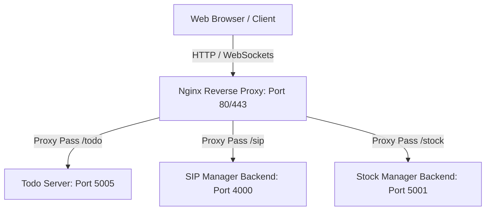

# Networking Architecture

This document describes how the applications in this monorepo communicate with each other, Nginx, and external services (like WhatsApp or databases) securely.

## Network Architecture

## Internal Service Endpoints
- **Nginx Proxy**: Serves as the ingress point. It is configured inside `infra/nginx/nginx.conf`.
- **Microsoft To Do App**:
  - Client: React/Vite app, built static assets are served by the express server.
  - Server: Express on port `5005`.
- **SIP Manager Pro**:
  - Client: React/Vite, connects to Backend via Apollo Client GraphQL (`http://localhost:4000/graphql`).
  - Server: NestJS on port `4000`.
- **Stock Manager App**:
  - Client: React/Vite, built static assets are served by the backend express server.
  - Server: Express on port `5001`.

## Secure Remote Networking (Tailscale)
Tailscale is configured to allow secure remote access without exposing ports:
1. Nginx listens on the host's private IP or the Tailscale interface (`100.x.y.z`).
2. Remote users connect using the Tailscale DNS/IP directly.
